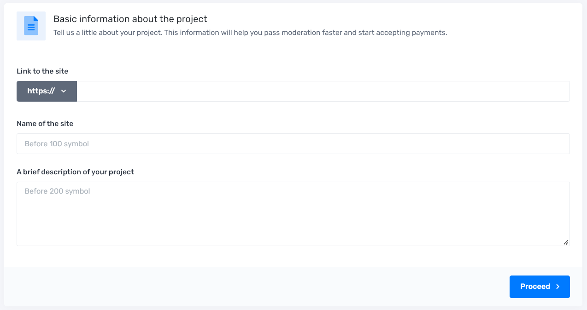

# Adding a store

After completing the registration and successfully confirming the account information, you can add your first project.

## Initial filling

Go to the add store page at [https://tegro.money/my/add-shop](https://tegro.money/my/add-shop)

<figure><figcaption></figcaption></figure>

Provide a link to your store, name and description

<figure><figcaption></figcaption></figure>

## Basic information about the project

Please note that the name of the project is used when making the payment as basic information about the name of the store in whose favor we make the payment.

A description of your project will help you quickly identify your category, and in certain situations, determine what exactly you are going to accept payments for.


**IMPORTANT:** The name must match the name of the product, project or company used on the site. The description should include the type of services and/or goods sold on the site.


Also, the system can not use two identical domains on different accounts.

_This is only possible when projects are in the archive._

## Confirmation

The next step is to confirm that you own the site, you can do this in any of three ways:

### First way

You need to place a specific text file in the root of your site, and then click "Add Project".

### The second way

You need to add to the html code of your homepage (head block) a special meta tag, which we gave you.

### The third way

You should add a DNS record of type TXT, which contains the value we specified.

After that, the system will check the contents of the file with a verification code automatically, and if they match, the project will be instantly added and sent for further moderation.

.png>)

After confirmation, you can move on to the [store setup](store-setup/).
